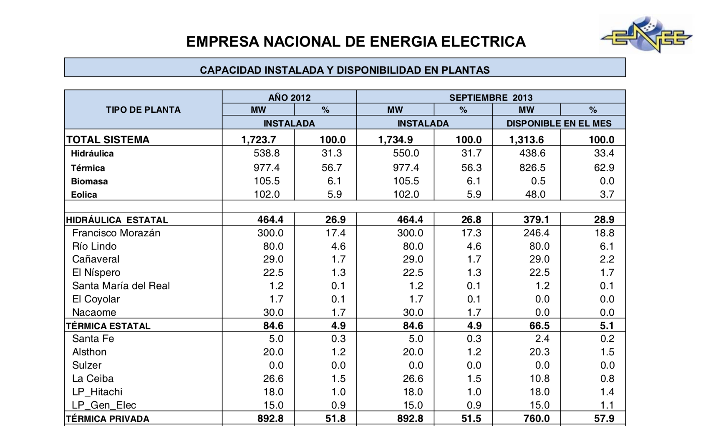
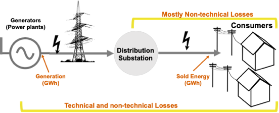

## Contents
{:.no_toc}
*  
{: toc}

## Methodology

We analyze previously unexplored sector data to obtain a better understanding of the sector. We question why these attempts have not fully addressed the persistent issues in the sector. After conducting a thorough review of
the literature on Honduras’ electricity sector, we conclude that clean and reliable data is a principal barrier for further analysis and subsequent policy recommendations. We take on the challenge of collecting and cleaning data that is dispersed throughout various institutions in the country.

The data collected covers the time period between January 2012 to October 2018. There is a total of 82 months’ worth of data coming from various public sources. In some instances, the datasets used for analysis contain up to 6,938 unique observations.
This policy paper, through the use of data analysis, dives deep into exploring the issues being confronted by the power company and the government in order to:

1. Shed light on what are the underlying causes of the sector’s inefficiencies.
2. Learn what the analysis of large datasets can do for a power sector.

## Data Collection

Gathering and collecting data has been challenging. Whenever possible, data has been obtained from public sources. The main source of data has been ENEE’s public website where it publishes a monthly statistics report of the electricity sector found 
[here](http://www.enee.hn/index.php/planificacionicono/182-boletines-estadisticos "ENEE Monthly Statistics"). The reports published date back to January 2007 and contain information relating to electricity generation, consumption and usage. The analysis conducted for this paper focuses on the time period between January 2012 to October 2018, hence there is a total of 82 months’ worth of data coming from these documents. Due to the nature of how the data is presented, in some cases, the datasets used for analysis contain up to 6,938 unique observations.

There is little information within these documents that relate to ENEE’s finances. This information had to be complemented with data obtained from the Honduran Institute for Access to Public Information (IAIP) which hosts an abundance of information about Honduran public institutions found [here](https://portalunico.iaip.gob.hn/ "IAIP Website"). On their platform, ENEE’s monthly balance sheets can be found for the period between August 2015 and December 2018. Unfortunately, these files vary from balance sheet to balance sheet and do not go much into financial details, hence not much information can be extracted from them. Additionally, delinquency data for December 2018 was obtained from the IAIP website. The delinquency report identifies users who are delinquent on their electricity bill. We used this data (at the aggregate level) to estimate the potential gains from collecting on electricity bills.

## Data Cleaning

The original data sets were in Portable Document Format (PDF) and in the Spanish language. We cleaned datasets and made CSV (Comma-separated values) format files for data analysis. This was an arduous task as the internal formatting of the files vary from document to document and we had to make sure to consistently extract the correct information.

*Sample of ENEE monthly reports*

## Assumptions

During data analysis process, we made some assumption about the exact definition of what the data referenced. We attempted to verify these assumptions with the Honduran government as much as possible, but we did sometimes fail to obtain a clear answer.

In the generation dataset, we make an assumption about the definition of the “sold energy” energy variable. We assumed that this value represents the total energy in Megawatt hours (MWh) delivered to the registered end users in the distribution network.

We have questions about a negative data point we found in the amount of energy sold to the residential consumers during the month of May 2018. Income from the selling energy to the residential sector was negative as well. We could not verify why this was the case and decided to keep it in our analysis with assumption that the money was paid back to the residential consumers.

Another assumption we made is that total technical losses in the transmission and distribution grid is almost constant and that any variation in the total electricity losses (from the generation to the end user’s metering system) is explained by non-technical losses, such as improper metering or theft.

*Schematic graph of losses in the grid based on our data assumptions*

Finally, we assume that the values in the sold energy dataset are the payments made by subscribers in regard to their energy consumption.
