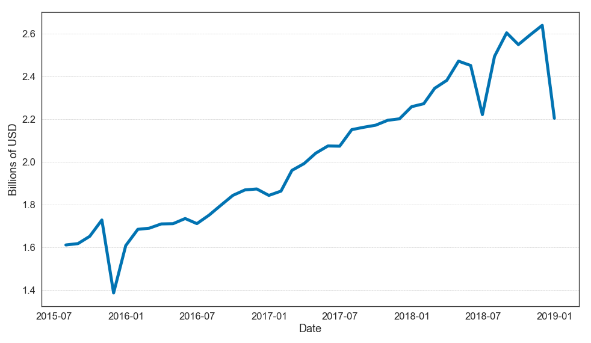
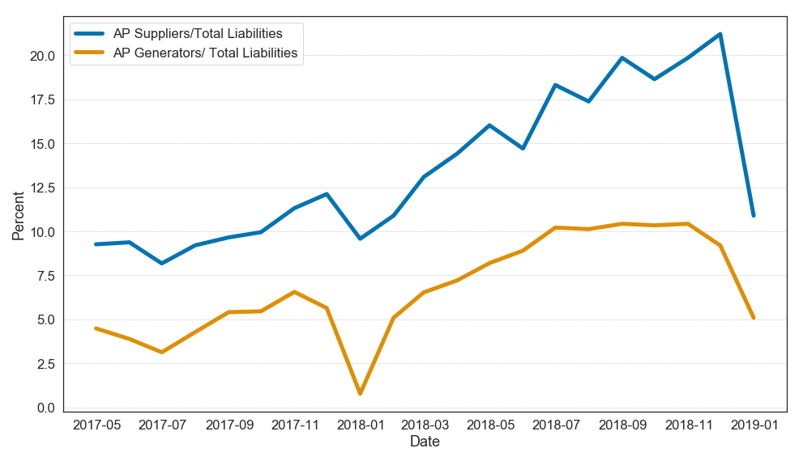
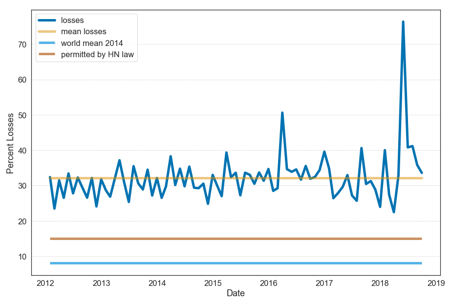
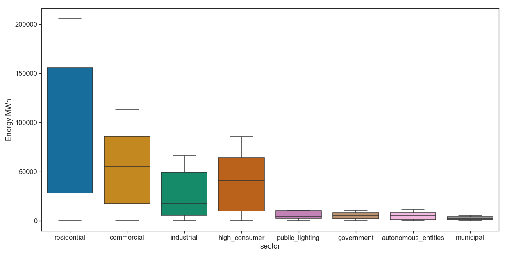
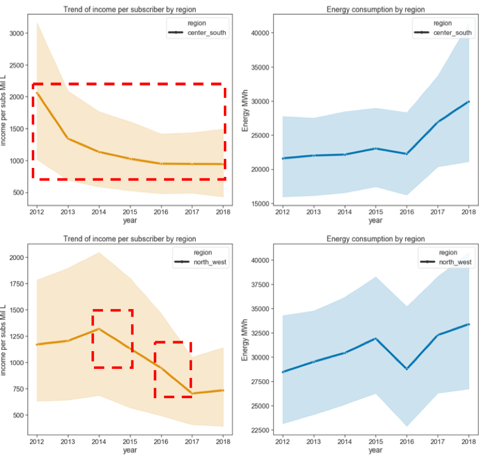
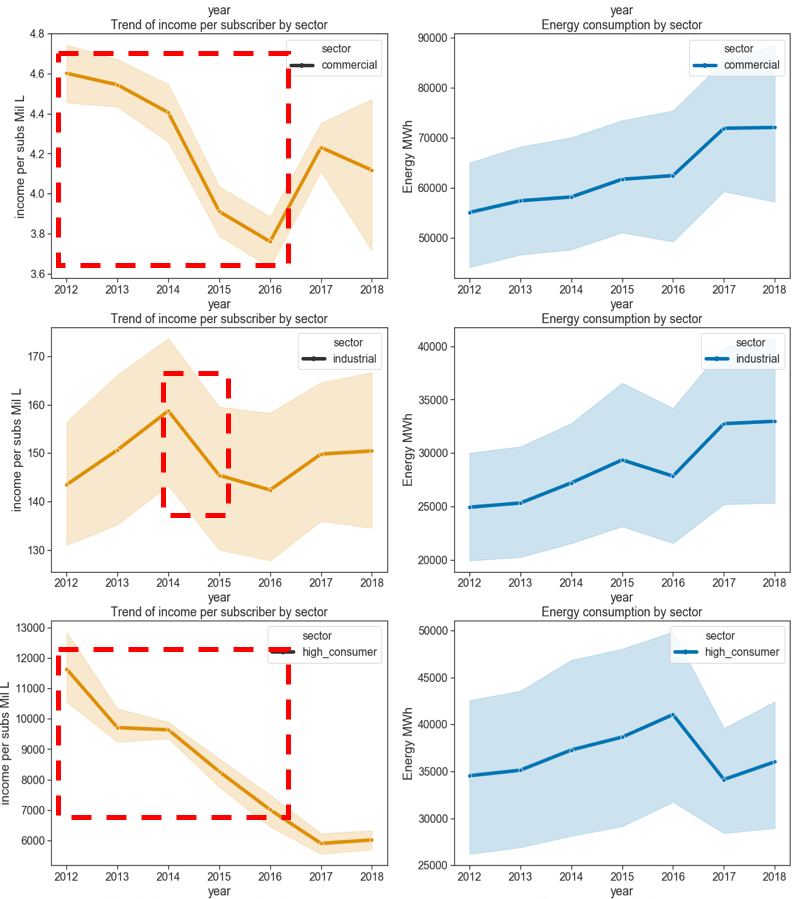
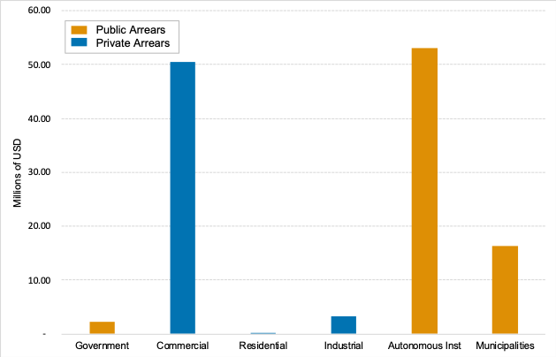

## Contents
{:.no_toc}
*  
{: toc}

Our EDA consisted of an exploratory step in which we used different methods for data plotting in order to find any noteworthy trends or characteristics in the variables. As a result of this step, we began to formulate hypothesis about the probable root causes of the inefficiency problem, as well as defining a basic model for estimating the impact of possible policy interventions.

We explored several trends that are present in the electricity sector during the period between 2012 and 2019 using all the datasets we have available. We present our findings below.

## Energy Generation

The following graphs are a decomposition of energy generation and installed capacity. It presents the energy generated from renewable sources (hydro, biomass, wind, solar and geothermal) and from non-renewable resources (oil, diesel and gas presented as “thermal” generation and carbon). Figure 8 shows the net energy generated and injected into the grid as a percentage of total. Notice that renewables now dominate electricity generation, going from approximately 44% in 2012 to over 60% in 2018. This change can be attributed to the incentives given in the Renewable Energy Law. Of particular interest is the appearance of solar beginning in 2015 when the law was amended to further incentivize solar generation.

*Energy generation in the Honduran Grid*

We see that the technology mix of installed capacity for electricity power plant has been changing between 2012 to 2018. Renewables now represents more than 50% of the installed capacity of power plants and the share of fossil fuel based technology (thermal) has reduced significantly which helps the country to move away from importing oil and dependency on its price.

*Installed Capacity by Energy Technology 2007-2018*

## ENEE's Finances

We looked into ENEE’s finances from recent years (2015 – 2018) as this is the only data publicly available. The principal goal behind this analysis is to understand more about the behavior and composition of ENEE’s liabilities. We looked at ENEE’s total liabilities in both nominal terms and in constant 2018 prices. Our analysis shows that ENEE’s total liabilities have grown from about USD 1.8 Billion to USD 2.2 Billion during this time period. Figure 11 shows the trend of the ENEE liabilities as percentage of GDP during 2015-2017. 

The general trend is one of growth. ENEE’s liabilities in 2017 were equivalent to 9.87% of GDP . This is worrisome as it has been the government’s belief that the injection of capital from the bonds it issued was going to alleviate ENEE’s financial situation.

*Monthly Total Liabilities ENEE (current prices 2018)*

*ENEE Liabilities as Percentage of GDP (2015-2017)*

This raises the question as to what is causing the increase in liabilities. We decomposed ENEE’s finances a bit further in order to try and glimpse into what might be the cause. Initially believing that private energy contracts might be the cause, we analyzed what share of total liability is represented by the accounts payable to suppliers of services to ENEE.

*Share of total liability for suppliers and generators*

The accounts payable to suppliers (the blue line) represents the sum of payments owed to all suppliers to ENEE (energy generators, goods and service providers, and others). Even though it shows growth, these accounts payable represent at most 22% of liabilities. The share of payments made specifically to energy suppliers (the orange line) represents at most 10.5% of total liabilities. This shows that only a small percentage of liabilities is explained by payments to energy generators. Additionally, this graph demonstrates that reducing contracting costs will not solve the bulk of ENEE’s financial liabilities. Unfortunately, with the data available, further decomposing ENEE’s liabilities cannot not be done.

## Energy Losses

Another worrisome piece of data is the trend found in transmission and distribution losses in the grid. Electricity losses in Honduras during the past six year have been 32.14 %, on average. This is far above the 8 percent world average electricity losses, and still above the 15% Latin American and Caribbean average . This loss includes both technical and non-technical losses . The variation of distribution losses can be due to meter tampering, improper metering, and illegal connections . Even though EEH (the private distributor) was hired to lower energy losses in the system, there average and the variation in losses remains high. The peak observed in May of 2018 is due to the assumption that energy was returned to residential sector.

*Transmission and distribution losses in Honduras*

## Energy Consumption

The following graph represents a boxplot diagram of energy consumption for by sector. The four main consumers are the residential, commercial, and high consumers. Thus, any policy interventions in these sectors would have significant financial impacts. It is important to note that the within sector variation observed in this graph is explained by variation coming from the different regions.

*Distribution of energy consumed by sector*

The figure below presents the trends in average electricity demand by each sector. Most trends are increasing, especially among the main four consumers (residential, commercial and industrial sector.) As a result, any further investigation toward energy loss improvement would have the largest impact if started in these sectors. Additionally, taking into the fewer number of subscribers in commercial sector when compared to the large number of residential subscribers, it would be more administratively feasible to consider initial interventions in the commercial sector.

*Trend of Average electricity energy demand by sector*

The data seen so far raises the question of: what is the trend in payment per subscriber for the different sectors and regions? The findings to this question for the commercial, industrial and high consumer sectors are presented below. There are some noteworthy patterns among some sectors and regions. As highlighted with the red rectangles in the figures, there are some period during 2012-2016 in which the commercial sector payment per subscribers has been decreasing while their energy consumption was increasing. There is similar behavior in other large electricity consumers such as in the industrial sector and high consumers. Possible explanations of these trends are subsidies or non-technical losses.

*Trends of “Total Energy Consumption” vs “Income per Subscriber” by sector*

Another informative comparison of payment per subscriber behavior with their consumption pattern by region. The result of this comparison are shown in the figure below. As highlighted with a red square, there is a similar pattern of decreasing payment per subscriber while increasing consumption in the center south and north west regions.

*Regional comparison between the trends of income (payment) per subscriber versus energy consumption*

## Data on Energy Delinquency

Preliminary results show that by the end of December 2018, the total debt owed to ENEE is approximately $155.81 Million, equivalent to 0.7% of GDP. Figure 18 shows that the public sector owes the most money to ENEE (65% of the debt). The commercial sector follows, representing 32.4% of the total debt owed to ENEE. It might not be a surprise that public entities are not paying for electricity , but it is a surprise to see the commercial sector owing so much on electricity bills.

*Total Debt Owed to ENEE by Sector (December 2018)*

