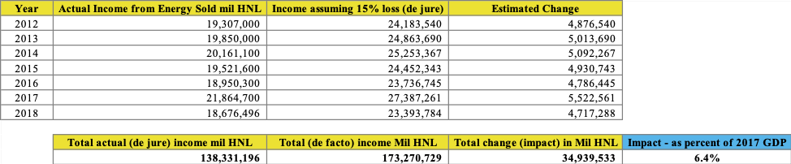

## Contents
{:.no_toc}
*  
{: toc}

As a result of the exploratory data analysis, important question relating to generation, consumption, payment, and ENEE’s financial liabilities become sufficiently clear to be able to recommend specific policy interventions. In this section we present our policy recommendations along with an estimation of the impact each option could have. We first address what it would mean if the government decides to take no action. We then present the recommended policies which were chosen based on their: i) potential impacts, ii) technical correctness, iii) political and administrative feasibility.

## Keeping Status Quo

Addressing the status quo is important in order to place our policy recommendations in perspective. Keeping the status quo implies:

1.	Electricity losses will remain high at around the average 32.14 %.
2.	ENEE Liabilities will keep growing.
3.	A significant fraction of consumers will not pay their electricity bill.
4.	Subsidies in the sector will remain unclear.
5.	Incentives to renewables will remain high.

As presented throughout this document, this situation is costly to ENEE and to the government. ENEE’s finances have not improved over the past 7 years and the policy of keeping the status quo will result in continued poor financial performance of the sector.

Additionally, under the IMF Standby Agreement signed in 2014, Honduras committed to “[restoring] positive operating margins and [eliminating] ENEE’s overall deficit progressively by 2018. ” This is a condition that is not being met. Not upkeeping the standby agreement with the IMF could have macro-financial implications as the country’s access to better credit options could be limited.

On the upside, current conditions have made renewables the dominant source of electricity generation in Honduras. This means that Honduras’ generation is no longer primarily dependent on imported fuels for the generation of electricity. We must caution the reader, though, that the financial implications of substituting imported fuels for renewables is an issue that is not addressed in this study. This is a topic for future research that should be of interest to the Honduran government.

## Policy Recommendations

ENEE’s problems are many. Past sector studies have suggested the government to focus on solving the following issues:

•	Improving contracting practices with power generators (mostly with thermal).
•	Adjusting the tariff structure to recover costs.
•	Lowering the dependency on oil imports.
•	Investing on grid infrastructure to lower electricity losses. And,
•	Improving the financial management of ENEE.

Although these are all technically correct recommendations, it has been difficult for the government to effectively act upon all of them. These recommendations would work under an unconstrained environment. It is therefore important to give priority to those interventions that will have the largest impacts given current constraints. We take into consideration possible political and administrative barriers when proposing recommendations. 

Our comprehensive approach to data analysis has found that the sector’s current financial situation is primarily due to: i) the high level of electricity losses in the system (32.14%), ii) the accumulation of debt from direct and indirect subsidies as a result from undefined subsidy processes, and iii) the lack of collecting on electricity bills. Our policy recommendations directly address these issues which we categorize in the following manner: i) budgetary recommendations and ii) loss management recommendations.

### Budgetary Recommendations

These recommendations focus on significantly improving the financial sustainability of ENEE. The proposed actions are effective both in the short- and long-run.

**Collecting on delinquent users:** There are two principal groups that are not paying for electricity which together represent 97.4% of this debt: i) the public sector representing 65%, and ii) the commercial sector representing 32.4%. 
We recommend the Ministry of Finance to define a mechanism that enforces payment of electricity consumption of public institutions. At the same time, the Ministry of Finance should decide which public institutions it will subsidize and who would be responsible for this subsidy. For example, the government may wish to decide not to charge a public hospital for its consumption of electricity.

ENEE and the government must also enforce collection from the commercial sector. Collection is happening in both the industrial and residential sectors, implying that there is capacity to collect. It is important, given that this is a significant portion of their debt, that ENEE begins to enforce collection on the commercial sector. This could be done immediately. Additionally, it is important to note that the commercial sector is the second largest consumer of electricity in the country, hence the importance of collecting on their electricity bills.

### Loss Management Recommendations

These recommendations focus on reducing electricity losses and identifying the indirect subsidies given to some consumers.

**Addressing electricity losses:** Electricity losses are high (32.14%), much higher than the world average (8%) and higher than the Latin American and Caribbean average (15%) . In an unconstrained environment, the reduction of losses should happen at the country level in all regions and in all sectors. Unfortunately, this can be expensive, plus the government attempted to do this through the signing of PPP with EEH which has produced little results. Therefore, given the current administrative constraints, the government needs to have a deeper understanding of the problem. Our analysis found strange consumption patterns of behavior in the commercial sector for both the northwest and central-south regions of the country. Given the limitations of the data used for this analysis, we cannot further distinguish whether these patterns of behavior are due to theft, subsidies, or some other factor. Therefore, ENEE needs to start metering and gathering metering data in a proper and formal manner. It is our recommendation that the government aids ENEE in implementing a rigorous remote metering program in the commercial sectors in the northwest and center-south regions of the country as a starting point.

**Identifying indirect subsidies:** If ENEE were to reduce non-technical losses to zero, then any indirect subsidies given through improper metering would disappear. In order to determine the size of this indirect subsidy proper metering must happen (as addressed in the previous recommendation). Once this indirect subsidy is identified, and assumed eliminated through the reduction of losses, the government must define a subsidy process if it so wishes to provide one.

### Impact Estimation and Timeline

**Estimated impact from collecting on delinquent users:** The amount of money owed to ENEE at the end of December 2018 totaled \\$155.81 Million (0.7% of GDP). If the ENEE were to collect the debt owed by the public entities, it would recover \\$101.28 Million, and if it were to collect from the commercial sector, it would recover an additional \\$50.48 Million. This could be done in the short term. ENEE has the capacity to do so as it successfully collects bills from both the industrial and residential sectors. Collecting debt from public institutions needs to be solved from within the government. As a short-term option, the government could quickly define an electricity consumption budget for public entities that it could enforce. Charging for electricity would have the added benefit of inducing awareness of consumption levels, potentially leading to a reduction in the amount of electricity consumed by public entities.

**Addressing electricity losses and indirect subsidies:** A quick estimation of the impact for the loss management policy recommendation was calculated using the following logic. The current average electricity losses in Honduras is 32.14%, current Honduran law allows for the existence of at most 15% losses. The estimated income loss for not having lowered electricity losses to 15% during 2012 to October 2018 is estimated to be equal to 6.4% of 2017 GDP. Table 4 presents an estimate of the impact that losses have on ENEE’s finances.

<i>Estimated impact of electricity loss reduction</i>

As stated previously, we recommend the government help ENEE pilot a remote metering program in the commercial sector in either the northwest and central-south regions. This could be done in the short-term. In a further iteration of this, ENEE could expand the scope to the commercial and industrial sectors in all regions of the country. As previously mentioned, these are significant consumers of electricity. In the long-term, ENEE must look into adopting better metering for the residential sector as it the largest consumer of electricity in Honduras.
